# thesis-builder

将扩展 Markdown DSL 源文件自动编译为符合东北大学本科毕业设计（论文）书写印制规范的 Word 文档。

三阶段流水线：**Markdown → AST → .docx**


## 快速开始

```bash
pip install python-docx pyyaml
# 可选: pip install pillow (图片尺寸计算), 安装 plantuml (UML图渲染)

python main.py examples/compiler-thesis.md -o output.docx
```

仅检查不生成：
```bash
python main.py examples/compiler-thesis.md --check-only
```

## DSL 语法

### 元数据

```yaml
---
title: 论文题目
english_title: Thesis Title
student_id: 2025XXXXXX
student_name: 姓名
advisor: 导师姓名 教授
college: 软件学院
major: 软件工程
year: 2025
month: 6
---
```

### 章节和正文

```markdown
# 绪论              → 一级标题（章）
## 研究背景          → 二级标题（节）
### 具体问题          → 三级标题（小节）
正文段落直接书写。引用文献[1][2-3]会被渲染为上标超链接。
```

### 图片

```markdown
@figure{images/arch.png, caption=图标题, scale=0.8}
```

### 表格

```markdown
@table{caption=表标题}
| 列1 | 列2 | 列3 |
| --- | --- | --- |
| 数据 | 数据 | 数据 |
@end
```

三线表格式（顶线+表头分隔线+底线）自动应用。

### 代码块

```markdown
@code{python, main.py}
def hello():
    print("Hello")
@end
```

### PlantUML

````markdown

```plantuml caption=图标题, scale=0.8
@startuml
class Foo {}
@enduml
```

````

### 关键词 / 参考文献 / 致谢

```markdown
关键词：关键词1；关键词2；关键词3
Key words: keyword1; keyword2; keyword3

# 参考文献
[1] Author. Title[J]. Journal, 2024.

# 致谢
感谢...
```

## 项目结构

```
thesis-builder/
├── main.py              # CLI 入口
├── ast_nodes.py         # AST 数据模型
├── parser/
│   └── markdown.py      # Markdown → AST 解析器
├── checker/
│   └── content.py       # 内容规范检查器
├── builder/
│   ├── document.py      # AST → .docx 文档生成器
│   ├── styles.py        # 样式配置加载
│   ├── numbering.py     # 章节/图表自动编号
│   └── xml_helpers.py   # OOXML 辅助函数
├── config/
│   └── format.yaml      # 格式参数配置（字体/字号/边距等）
├── figures/              # 封面图片
├── tools/
│   └── migrate_thesis.py # Word → Markdown 迁移工具
└── examples/
    └── compiler-thesis.md  # 示例论文（本系统自身的论文）
```

## 配置

编辑 `config/format.yaml` 可调整所有格式参数：页面尺寸、边距、各级字体字号、行距、内容检查阈值等。无需修改代码。

## 内容检查

编译时自动检查并报告：

| 检查项 | 说明 |
|--------|------|
| 元数据 | 标题长度、必填字段 |
| 摘要 | 字数 400-700、关键词 3-5 个 |
| 章节结构 | 7 个必需章节是否存在 |
| 章节比例 | 各章篇幅占比 |
| 参考文献 | 数量及正文引用完整性 |
| 图表 | 资源文件是否存在 |
| 代码块 | 长度是否超出限制 |
| 图表密度 | 连续图表是否过多 |

## 命令行参数

```
python main.py <input.md> [-o output.docx] [--check-only] [-q] [-v] [-y]
```

- `-o, --output` — 输出路径，默认 thesis.docx
- `--check-only` — 仅检查，不生成文档
- `-q, --quiet` — 仅显示错误
- `-v, --verbose` — 详细输出
- `-y, --yes` — 有 error 时跳过确认

## License

MIT
