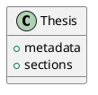

# thesis-builder

为 **东北大学软件学院** 本科毕业设计（论文）定制的论文编译器。用 Markdown 写论文，自动生成格式合规的 Word 文档。

写毕业论文时，大部分时间花在调 Word 格式上——字体字号、页边距、行间距、图表编号、参考文献格式……稍微改一点就要逐页检查。thesis-builder 让你用纯文本 Markdown 编写论文内容，一条命令编译出符合东北大学书写印制规范的 .docx，把时间留给内容本身。

**核心能力：**

- 扩展 Markdown DSL，支持图片、三线表、代码块、PlantUML 图等学术元素
- 自动按章编号图表（图1.1、表2.3），自动编号章节标题
- 参考文献[1][2-3]引用自动渲染为上标超链接，点击跳转
- 内置内容检查器：摘要字数、关键词数量、章节比例、引文完整性等十余项校验
- 格式参数全部外置为 YAML 配置，改配置不改代码即可适配不同要求

## 效果

编译后生成的 Word 文档——封面、摘要、目录、正文、参考文献、致谢，一气呵成：


完整编译效果见 [examples/thesis.pdf](examples/thesis.pdf)，[格式检测报告](examples/格式检测报告.pdf)。该 word 由 [examples/compiler-thesis.md](examples/compiler-thesis.md) 编译生成——它本身是一篇完整的论文，同时也是 DSL 语法的最佳参考。

## 快速开始

**环境：** Python 3.12+

```bash
pip install python-docx pyyaml
```

```bash
python main.py your-thesis.md -o thesis.docx       # 编译论文
python main.py your-thesis.md --check-only          # 仅检查，不生成文件
python main.py your-thesis.md -v -o thesis.docx     # 详细输出
```

可选依赖：
```bash
pip install pillow       # 图片按 DPI 计算尺寸
sudo apt install plantuml  # PlantUML 渲染（否则 @plantuml 指令跳过）
```

## DSL 语法

### 元数据 & 结构

```yaml
---
title: 论文题目
english_title: Thesis Title
student_id: 2025XXXXXX
student_name: 姓名
advisor: 导师 教授
college: 软件学院
major: 软件工程
year: 2025
month: 6
---
```

YAML frontmatter 声明元数据，自动填入封面和英文封面。

```markdown
# 绪论              → 章标题（自动另起新页）
## 研究背景          → 节标题（X.1）
### 具体问题          → 小节标题（X.1.1）

正文段落直接写。参考文献[1][2-3]自动渲染为上标超链接。
```

### 图片

```markdown
@figure{arch.png, caption=系统架构图, scale=0.8}
```

从源文件同级的 `figures/` 目录读取，自动按章编号。

### 三线表

```markdown
@table{caption=测试结果}
| 模块 | 用例数 | 通过率 |
| --- | --- | --- |
| 解析器 | 25 | 100% |
| 生成器 | 18 | 100% |
@end
```

自动应用学术三线表格式（顶线、表头分隔线、底线）。

### 代码块

```markdown
@code{python, main.py}
if __name__ == "__main__":
    main()
@end
```

### PlantUML

````markdown

````

编译时调用 `plantuml` 命令渲染为 PNG，自动按章编号。

### 摘要 / 关键词 / 参考文献 / 致谢

```markdown
# 摘要
摘要正文...

关键词：关键词1；关键词2；关键词3

# ABSTRACT
Abstract text...

Key words: keyword1; keyword2; keyword3

# 参考文献
[1] Author. Title[J]. Journal, 2024.

# 致谢
感谢...
```

这些特殊段落会被自动识别，放置到文档的正确位置。

## 内容检查

编译时自动运行检查器，生成文档前报告问题：

```
$ python main.py thesis.md --check-only
Parsing thesis.md ...
  done (7 chapters, 42 references)
Checking content ...
  ok [摘要] 摘要字数符合要求（536字）
  ok [关键词] 关键词5个
  error [章节比例] 系统实现篇幅占比偏低（14.7%，要求≥20%）
  error [参考文献] 参考文献数量不足（25条，要求≥40条）
  ok [参考文献引用] 所有参考文献均在正文中被引用
  2 errors, 0 warnings
```

| 检查类别 | 检查内容 |
|----------|----------|
| 元数据 | 标题字数、必填字段 |
| 摘要 | 字数范围、关键词数量 |
| 章节结构 | 必需章节是否存在 |
| 章节比例 | 各章篇幅占比 |
| 参考文献 | 数量、正文引用完整性、引用顺序 |
| 图表 | 资源文件是否存在 |
| 代码块 | 单个代码块长度 |
| 图表密度 | 连续图表是否过多 |

## 配置

所有格式参数集中在 `config/format.yaml`，修改即可适配不同要求：

```yaml
fonts:
  body:
    name: 宋体
    size: 12       # 小四号

page:
  width: 21.0      # A4
  margin_left: 3.0
  margin_right: 2.5
```

当前配置针对**东北大学本科毕业设计**规范。其他学校需自行调整。

## 架构

```
Markdown 源文件 → AST → .docx
```

```
thesis-builder/
├── main.py               # CLI 入口
├── ast_nodes.py           # AST 数据模型
├── parser/
│   └── markdown.py        # Markdown → AST 单遍解析器
├── checker/
│   └── content.py         # 内容规范检查器
├── builder/
│   ├── document.py        # AST → .docx 生成器
│   ├── styles.py          # 样式配置加载
│   ├── numbering.py       # 章节/图表自动编号
│   └── xml_helpers.py     # OOXML 辅助函数
├── config/format.yaml     # 格式参数配置
├── figures/               # 封面图片
└── tools/migrate_thesis.py  # Word → Markdown 迁移工具
```

## 命令行

```
python main.py <input.md> [-o output.docx] [options]
```

| 参数 | 说明 |
|------|------|
| `-o, --output` | 输出路径，默认 thesis.docx |
| `--check-only` | 仅检查，不生成文档 |
| `-q, --quiet` | 仅显示错误 |
| `-v, --verbose` | 详细输出 |
| `-y, --yes` | 有 error 时跳过确认 |

## 注意事项

- **封面图片：** 需在 `figures/` 目录放置 `cover_image1.jpeg` 和 `cover_image2.jpeg`，否则封面为空白
- **PlantUML：** 需系统安装 `plantuml` 命令，否则 `@plantuml` 指令显示错误占位文本
- **字体：** 生成的 .docx 引用宋体、黑体等字体，未安装时可能显示异常

## 局限性

本项目帮助你快速生成格式接近规范的初稿，**不保证 100% 满足所有格式要求**。

- **目录需手动刷新：** 生成 .docx 后，需在 Word 中右键目录选择"更新域"
- **续表问题:** 无法检测到表格被分割并自动加表题
- **部分格式需微调：** 封面布局、特殊段落间距等细节可能需要手动调整
- **内容责任自负：** 本工具只负责格式排版，论文内容的真实性、原创性和学术规范由作者本人负责

**本项目不能：**

- 替代 Word 精细排版——分栏、文本框、艺术字等需手动处理
- 渲染数学公式——不支持 LaTeX，公式需在 Word 中用公式编辑器插入
- 双向同步——生成的是一次性输出，不支持从 .docx 反向同步回 Markdown
- 保证通过格式检测——不同学院要求可能不同，最终以指导教师要求为准

## 联系方式

QQ: 3176733724

如果这个项目帮到了你，欢迎请我喝杯可乐 ☕ 觉得好用的话，给个 star ⭐，让更多被论文格式折磨的同学看到！也欢迎分享给你的同学。

## License

MIT
