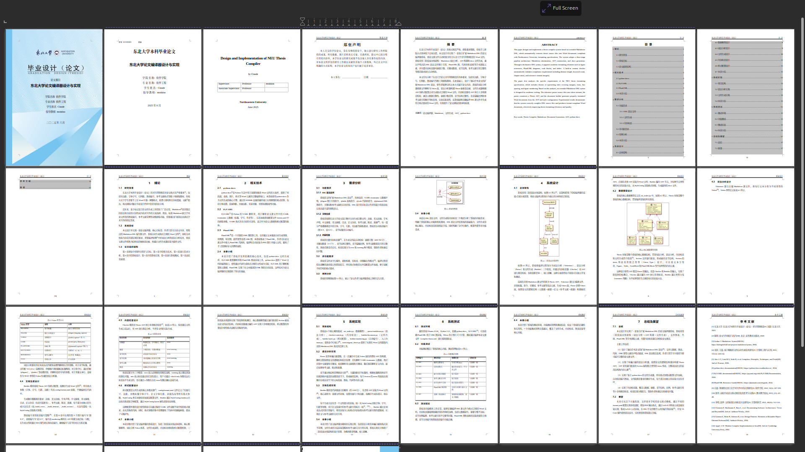
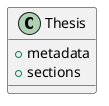

# thesis-builder

用 Markdown 写论文，自动生成格式合规的 Word 文档。

写毕业论文时，大部分时间花在调整 Word 格式上——字体字号、页边距、行间距、图表编号、参考文献格式……稍微改一点就要逐页检查。thesis-builder 让你用纯文本 Markdown 编写论文内容，一条命令编译出符合格式规范的 .docx 文件。

**features:**
- 扩展 Markdown DSL 语法，支持图片、三线表、代码块、PlantUML 图
- 自动按章编号图表（图1.1、表2.3），自动编号章节标题
- 参考文献[1]引用自动渲染为上标超链接，跳转到对应文献
- 内置内容检查器：摘要字数、关键词数量、章节比例、引文完整性等十余项校验
- 所有格式参数外置为 YAML 配置，改配置不改代码即可适配不同格式要求

## 效果

左边的 Markdown 源文件，编译后生成右边的 Word 文档——封面、摘要、目录、正文、参考文献、致谢，一气呵成：



完整的 40 页编译效果见 [examples/thesis.pdf](examples/thesis.pdf)。上面的效果由 `examples/compiler-thesis.md` 编译生成，这个文件本身就是一篇关于 thesis-builder 的完整论文，同时也是 DSL 语法的最佳参考。

## 快速开始

**环境要求：** Python 3.12+

```bash
pip install python-docx pyyaml
```

```bash
# 编译论文
python main.py your-thesis.md -o thesis.docx

# 仅检查内容规范，不生成文件
python main.py your-thesis.md --check-only

# 详细输出
python main.py your-thesis.md -v -o thesis.docx
```

可选依赖：
```bash
pip install pillow       # 图片按实际 DPI 计算尺寸
apt install plantuml     # PlantUML 图渲染（否则 @plantuml 指令会跳过）
```

## DSL 语法一览

### 论文结构

```yaml
---
title: 论文题目
english_title: Thesis Title
student_id: 2025XXXXXX
student_name: 姓名
advisor: 导师 教授
college: 软件学院
major: 软件工程
year: 2025
month: 6
---
```

YAML frontmatter 声明元数据，自动填入封面。

正文用 Markdown 标题表示章节层级：

```markdown
# 绪论            → 第一章（章标题，另起新页）
## 研究背景        → 1.1 节标题
### 具体问题        → 1.1.1 小节标题

正文段落直接写。参考文献[1][2-3]自动渲染为上标超链接。
```

### 图片

```markdown
@figure{arch.png, caption=系统架构图, scale=0.8}
```

图片从源文件同级的 `figures/` 目录读取，自动按章编号（图1.1、图2.1……）。

### 表格

```markdown
@table{caption=测试结果}
| 模块 | 用例数 | 通过率 |
| --- | --- | --- |
| 解析器 | 25 | 100% |
| 生成器 | 18 | 100% |
@end
```

自动应用学术三线表格式。

### 代码块

```markdown
@code{python, main.py}
if __name__ == "__main__":
    main()
@end
```

代码文件名显示在代码块下方。

### PlantUML

````markdown

````

编译时调用本地 `plantuml` 命令渲染为 PNG，自动按章编号。需要系统安装 PlantUML。

### 特殊段落

```markdown
# 摘要
摘要正文...

关键词：关键词1；关键词2；关键词3

# ABSTRACT
Abstract text...

Key words: keyword1; keyword2; keyword3

# 参考文献
[1] Author. Title[J]. Journal, 2024.

# 致谢
感谢...
```

摘要、关键词、参考文献、致谢会被自动识别并放置到正确位置。

## 内容检查

编译时自动运行内容检查器，在生成文档前报告问题：

```
$ python main.py thesis.md --check-only
Parsing thesis.md ...
  done (7 chapters, 42 references)
Checking content ...
  ok [摘要] 摘要字数符合要求（536字）
  ok [关键词] 关键词5个
  error [章节比例] 系统实现篇幅占比偏低（14.7%，要求≥20%）
  error [参考文献] 参考文献数量不足（25条，要求≥40条）
  ok [参考文献引用] 所有参考文献均在正文中被引用
  2 errors, 0 warnings
```

检查项包括：

| 类别 | 检查内容 |
|------|----------|
| 元数据 | 标题字数、必填字段完整性 |
| 摘要 | 字数范围、关键词数量 |
| 章节结构 | 必需章节是否存在 |
| 章节比例 | 各章篇幅占比是否符合要求 |
| 参考文献 | 数量、正文引用完整性、引用顺序 |
| 图表 | 资源文件是否存在 |
| 代码块 | 单个代码块长度 |
| 图表密度 | 连续图表是否过多无文字间隔 |

## 配置

所有格式参数集中在 `config/format.yaml`，包括页面尺寸、边距、各级标题的字体字号、正文行距、封面布局、内容检查阈值等。

修改配置文件即可适配不同格式要求，无需改代码。比如调整正文字号：

```yaml
fonts:
  body:
    name: 宋体
    size: 12       # 小四号
```

## 项目结构

```
thesis-builder/
├── main.py               # CLI 入口
├── ast_nodes.py           # AST 数据模型（Thesis、Section、Figure、Table 等）
├── parser/
│   └── markdown.py        # Markdown → AST 单遍解析器
├── checker/
│   └── content.py         # 内容规范检查器（十余项校验）
├── builder/
│   ├── document.py        # AST → .docx 文档生成器（~1100 行）
│   ├── styles.py          # 样式配置加载（format.yaml → StyleConfig）
│   ├── numbering.py       # 章节/图表自动编号
│   └── xml_helpers.py     # OOXML 底层操作辅助函数
├── config/
│   └── format.yaml        # 格式参数配置
├── figures/               # 封面图片
├── tools/
│   └── migrate_thesis.py  # Word → Markdown 迁移工具
└── examples/
    ├── compiler-thesis.md   # 完整示例论文
    ├── thesis.pdf           # 编译效果（40页）
    └── output-preview.png   # 编译效果截图
```

编译管线：**Markdown 源文件 → AST → .docx**

1. Parser 单遍扫描源文件，构建 Thesis AST（递归嵌套的 Section 树 + 联合类型的 items 列表）
2. Checker 遍历 AST 执行规范校验
3. Builder 遍历 AST，为每种节点调用对应的渲染方法，从 StyleConfig 读取格式参数

## 命令行

```
python main.py <input.md> [-o output.docx] [options]
```

| 参数 | 说明 |
|------|------|
| `-o, --output` | 输出路径，默认 thesis.docx |
| `--check-only` | 仅检查，不生成文档 |
| `-q, --quiet` | 仅显示错误 |
| `-v, --verbose` | 详细输出 |
| `-y, --yes` | 有 error 时跳过确认直接生成 |

## 注意事项

- **封面图片：** 需要在 `figures/` 目录放置 `cover_image1.jpeg` 和 `cover_image2.jpeg`，否则封面为空白
- **PlantUML：** 需要系统安装 `plantuml` 命令。未安装时 `@plantuml` 指令会显示错误占位文本，不影响其他内容
- **字体依赖：** 生成的 .docx 引用了宋体、黑体等字体，在对应字体未安装的系统上打开可能显示异常
- **Word 兼容性：** 生成的文档使用 OOXML 域代码实现图表编号和目录，需在 Word 中右键"更新域"刷新目录和编号
- **格式适配：** 当前配置针对东北大学本科毕业设计规范。其他学校需修改 `config/format.yaml`

## License

MIT
